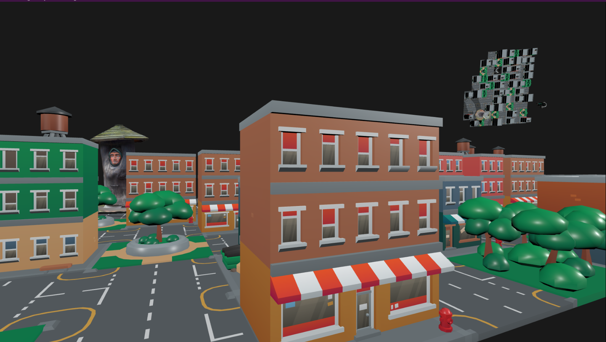
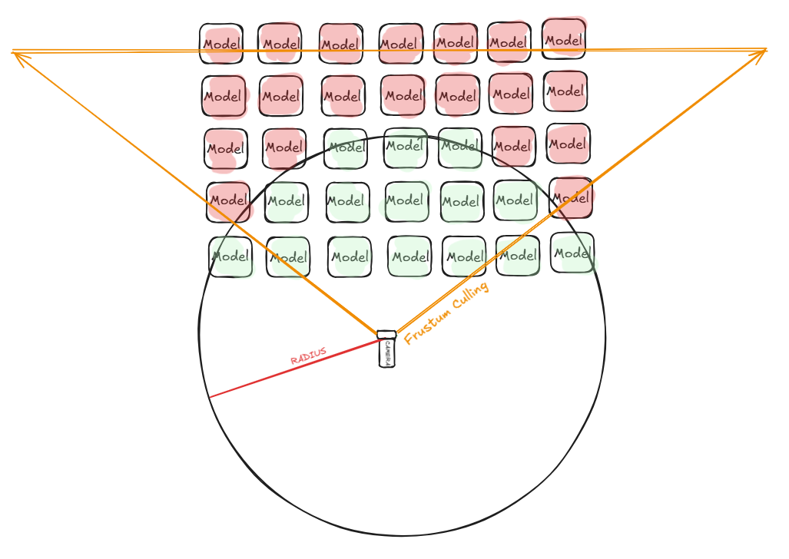
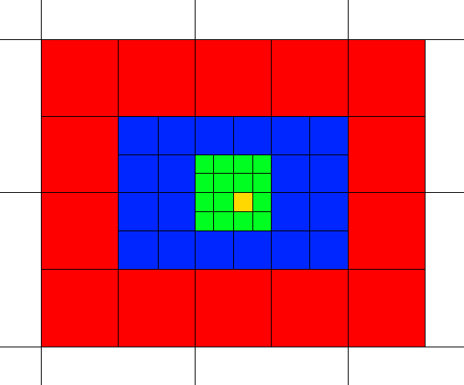
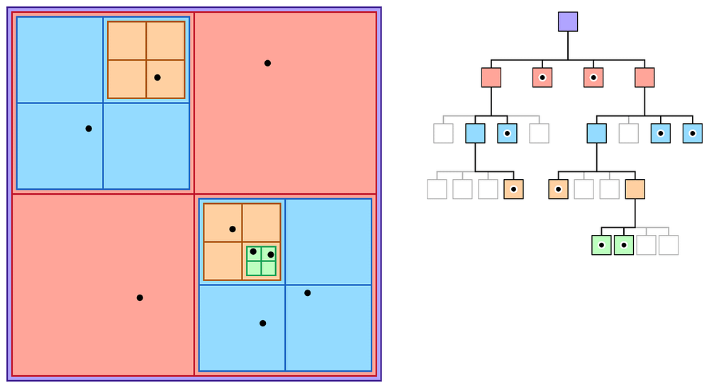
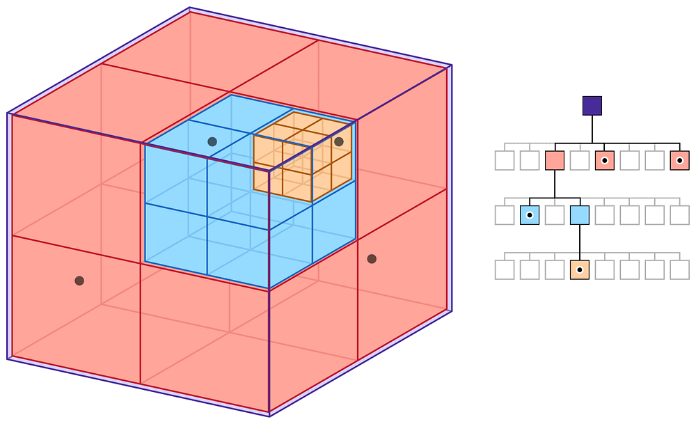

Have you ever been playing a game that lets you explore freely, only to hit a **loading screen** out of nowhere? Personally, I find loading screens a bit disruptive, so I looked into how large games tackle this challenge. That’s when I came across something called **Level Streaming**.

----------

## Quick Introduction

I am a second-year student at **Breda University of Applied Sciences**, enrolled in the Creative Media & Game Technologies course. In this blog post, I will introduce **level streaming in open-world games**, explaining what it is, exploring some common techniques, and sharing my own implementation in C++.



Image of level streaming in action.

### What is Level Streaming?

At its core, **level streaming** is a game development technique that dynamically loads and unloads portions of a game’s world based on the player’s location and actions. Rather than loading an entire world all at **once**, which would be resource-intensive and impractical, **level streaming** ensures that only the **necessary** assets are active in memory. This includes textures, models, animations, and even gameplay logic.

To incorporate level streaming into your game development, there are several techniques worth exploring, including **Distance-Based Streaming** or **Trigger Volumes, Asynchronous Loading, Frustum Culling, Level of Detail (LOD), Chunk-Based Loading** and **Spatial Partitioning.**

### Asynchronous Loading

This technique is one of the best options to implement in your game if you want to include level streaming. The reason is that **loading** a large bundle of data all at once can cause significant lag in the game. To avoid this, the loading process is handled on a separate **thread** while the main thread is dedicated solely to rendering. Here’s the underlying logic:

```pascal
function load_assets_async(asset_list):  
    for each asset in asset_list:  
        await load_asset(asset)
```

This is the logic behind how I implemented it. Since I already had a thread pool integrated into my engine, I decided to utilize that. Whenever I needed to load multiple models into my game, I used **tiny_gltf** to load the model and its texture image with **stbi_image** on a separate thread from the thread pool. Only when the loading was complete did I add the model to the screen.

To keep track of all the tasks assigned to separate threads, I used a `std::vector` of `std::future` objects, allowing me to access the results they returned. I created a simple function to check if a future task was completed, and once it was, I added the model to the screen using the returned data. Below is a condensed version of how I implemented this in code:

```c++
void StreamLevel::LoadMultipleModelThreadPool()  
{  
    dispach.reserve(row * cols);  
    for (int i = 0; i < row*cols; i++)  
    {   //Enqueue load model function on another threads  
        std::future future = ThreadPool().Enqueue(LoadModel, filePathsModels[i].path);  
        dispach.emplace_back(ModelDispatch{std::move(future), i});  
    }  
}  
std::shared_ptr<Model> LoadModel(const std::string& path)  
{  //Load model with tiny_gltf library  
    Model model = LoadResource;  
    model->m_image_datas.reserve(model->GetImages().size());  
  
    for (int i = 0; i < static_cast<int>(model->GetImages().size()); i++)  
    {  
        //Load texture image with stbi_image library  
        //  and store the image data inside the model.  
        model->m_image_datas.emplace_back(image_data);  
    }  
    return model;  
}  
void StreamLevel::Update()  
{  
    if (!dispach.empty())  
        for (int i = 0; i < dispach.size(); ++i)  
        { //Is checking every future from the dispach  
            if (dispach[i].future.valid())  
                if (ThreadPool::IsReady(dispach[i].future))  
                    auto data = dispach[i].future.get();  
                    if (!data) continue;  
                    // If it is ready add the model to scene  
                    AddToScene(data, dispach[i].modelIndex);  
        }  
} 
```

### Distance-Based Streaming and Frustum Culling

The next step in implementing level streaming in your project is determining which objects in the world should be streamed. This involves checking key conditions: Are the models within a certain distance of the player? Are they within the player’s field of view? These checks form the basis of the logic behind effective level streaming.

```pascal
function distance_stream(asset_list):  
    for each asset in asset_list:  
      if is_in_distance(player.position, radius)  
        if is_in_frustum(asset)   
          true: stream_asset(asset)  
        else  
          false: unload_asset(asset)
 ```



The circle represents the area that is streamed. The triangle represents the frustum culling. Combined, they stream only the green-highlighted models.

----------

As shown in the image, the logic is simple: if an object is within the **camera’s distance** and **field of view**, stream it. To calculate the distance between the camera and the models, I used the `glm::distance` function, which provides the distance between two points in the world. If the result _exceeds_ the radius, the object is **unloaded** from memory.

For frustum culling, I implemented the method from Learn OpenGL ([LINK](https://learnopengl.com/Guest-Articles/2021/Scene/Frustum-Culling)). Whenever **frustum culling** is activated, it updates every frame and checks if the models are within the frustum. If they are not, the objects are **unloaded** from the game.


Showcase on how distance streaming and frustum culling working (in corner right is a mini-map from top)

```c++
void StreamLevel::Update()  
{  
  //...  
  if (isStreaming)  
      {  
          if (isFrustrum)  
          {    
              auto view_matrix =  GetViewMatrix();// Camera view matrix  
              culling::UpdateFrustum(frustum, view_matrix, Camera.position);  
          }  
          for (int i = 0; i < row * cols; ++i)  
          {  
              auto& modelData = filePathsModels[i];  
    
              if (isFrustrum && !IsInFrustum(frustum, modelData.collision))  
              { //If the model is not in the frustum unload it  
                  TileDestroy(i);  
                  modelData.stream = false;  
                  continue;  
              }  
    
              if (glm::distance(modelData.position, Camera.position)) > radius)  
              { //If the model is not in the radius unload it  
                      TileDestroy(i);  
                      modelData.stream = false;  
              }  
              else if (!modelData.stream)  
              { //If the model is in the radius and frustum LOAD it  
                  auto future = ThreadPool().Enqueue(LoadModel, modelData.path);  
                  dispach.emplace_back(ModelDispatch{std::move(future), i});  
                  modelData.stream = true;  
              }  
          }  
      }  
 //...  
}
```

### Additional Methods to Achieve Level Streaming

The following techniques were not implemented in my game, but I believe they could be great additions to **enhance my project**. I will briefly explain them.

**Level of Detail (LOD)** is  a technique that adjusts the complexity of 3D models based on their distance from the camera. Objects that are far away from the player can be rendered with less detail, saving processing power. For example, Fortnite and Apex Legends are using an LOD system to increase FPS and have immersive gameplay. You can recognise that whenever you use the sniper, you can see models in less detail.



Map of level of details from yellow the most details to white the least. (Credit — [https://developers.meta.com/horizon/documentation/unity/po-assetstreaming/](https://developers.meta.com/horizon/documentation/unity/po-assetstreaming/))

**Trigger Volumes:** This technique loads a region whenever a boundary, an event, an interaction, or even a gaming mechanic takes place. Therefore, these triggers **load and unload** certain areas of the map that you will explore as you pass through a cut scene, open a door, or simply hit a spawn point. You can manually choose what to load when you want to use this method, but it could potentially be problematic if you load too much. When you pass through a large object in Uncharted, there is a cut scene that is a hidden loading. Similarly, when you leave a house in Assassin’s Creed, you may witness a lagging spike that is a loading of numerous models.

**Chunk-Based Loading,** a simple method for **grouping** assets into a grid. Once you determine which chunk of the grid the object belongs to, it becomes easier to stream it. The best example of this is Minecraft. Initially, it generates the map, and afterward, it loads only a specified radius of chunks, based on the player’s selection.

**Spatial partitioning** is the process of _breaking up_ the game world into smaller, more **manageable chunks**. This lets the game engine know which parts, depending on the player’s position, need to be loaded. You can streamline computations by segmenting the view or world into manageable chunks rather than examining each pixel.

Two _popular_ techniques exist for spatial partitioning:

1.  **Quadtrees:** This technique recursively splits a plane into four parts. 2D and 3D games with flat environments benefit greatly from it.
2.  **Octrees:** Using this technique, a cube is recursively divided into eight halves. It works well in 3D environments.



How a Quadtree is divided (Credit : [https://carlosupc.github.io/Spatial-Partitioning-Quadtree/](https://carlosupc.github.io/Spatial-Partitioning-Quadtree/))



How an Octree is divided. (Credit : [https://carlosupc.github.io/Spatial-Partitioning-Quadtree/](https://carlosupc.github.io/Spatial-Partitioning-Quadtree/))

### Challenges in Level Streaming

While level streaming is a powerful tool, it’s not without challenges:

1.  **Pop-In and Delays:** If assets aren’t loaded in time, players may notice objects appearing abruptly. This can break immersion and frustrate players.
2.  **Debugging Complexity:** As you advance the level of streaming, you add more levels of complexity to your code. Therefore, it’s crucial to include a lot of information about what your code is doing in order to make debugging easier. The code is much simpler and easier to handle with this testing. Furthermore, you ensure that assets load precisely and efficiently without causing performance issues.

## Conclusion

Level streaming is an essential technique for developing immersive, enormous open-world games. By allowing creators to properly manage resources and create seamless experiences, we improve the experience in open world games. The game world is always expanding and becoming more complicated, making good level streaming critical for any game.


### Sources

[**Algorithmic Techniques For Dynamic Level Streaming In Game Development**  
_Dynamic level streaming is a crucial aspect of modern game development, allowing developers to create expansive worlds…_peerdh.com](https://peerdh.com/blogs/programming-insights/algorithmic-techniques-for-dynamic-level-streaming-in-game-development "https://peerdh.com/blogs/programming-insights/algorithmic-techniques-for-dynamic-level-streaming-in-game-development")[](https://peerdh.com/blogs/programming-insights/algorithmic-techniques-for-dynamic-level-streaming-in-game-development)

[**Spatial-Partitioning-Quadtree**  
_Spatial ordering optimization: Quadtree_carlosupc.github.io](https://carlosupc.github.io/Spatial-Partitioning-Quadtree/ "https://carlosupc.github.io/Spatial-Partitioning-Quadtree/")[](https://carlosupc.github.io/Spatial-Partitioning-Quadtree/)

[**Meta Developers**  
_Edit description_developers.meta.com](https://developers.meta.com/horizon/documentation/unity/po-assetstreaming/ "https://developers.meta.com/horizon/documentation/unity/po-assetstreaming/")[](https://developers.meta.com/horizon/documentation/unity/po-assetstreaming/)

[**Async operation handling**  
_Several methods from the Addressables API return an AsyncOperationHandle struct. The main purpose of this handle is to…_docs.unity3d.com](https://docs.unity3d.com/Packages/com.unity.addressables@1.9/manual/AddressableAssetsAsyncOperationHandle.html "https://docs.unity3d.com/Packages/com.unity.addressables@1.9/manual/AddressableAssetsAsyncOperationHandle.html")[](https://docs.unity3d.com/Packages/com.unity.addressables@1.9/manual/AddressableAssetsAsyncOperationHandle.html)

[https://toxigon.com/unreal-engine-level-streaming-guide](https://toxigon.com/unreal-engine-level-streaming-guide)

[https://dev.epicgames.com/documentation/en-us/unreal-engine/level-streaming-overview?application_version=4.27](https://dev.epicgames.com/documentation/en-us/unreal-engine/level-streaming-overview?application_version=4.27)